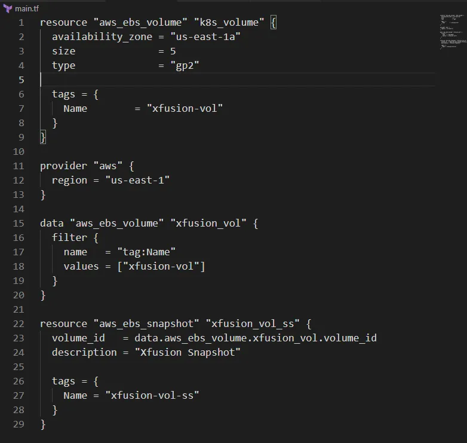

Membuat snapshot dari EBS volume bernama xfusion-vol di region us-east-1 menggunakan Terraform.

untuk backup dan pemulihan data

Update File main.tf

Di direktori /home/bob/terraform, update file main.tf

penjelasan:

provider “aws”: Mengatur region AWS ke us-east-1.

data “aws_ebs_volume”: Mengambil data volume xfusion-vol berdasarkan tag Name.

aws_ebs_snapshot: Membuat snapshot xfusion-vol-ss dari volume xfusion-vol dengan:

volume_id: ID volume dari data source.
description: Xfusion Snapshot.

tags: Tag Name = “xfusion-vol-ss” untuk identifikasi.