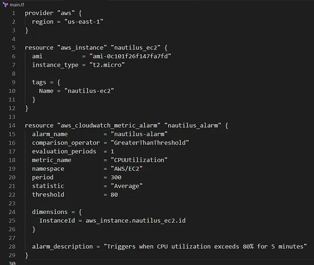

Membuat CloudWatch alarm bernama nautilus-alarm di region us-east-1 menggunakan Terraform, dengan spesifikasi berikut:

Memantau CPU utilization dari EC2 instance (diasumsikan instance nautilus-ec2 dari tugas sebelumnya).
Memicu alarm jika CPU utilization melebihi 80%.
Periode evaluasi: 5 menit (300 detik).
Jumlah periode evaluasi: 1 periode.
Konfigurasi ditulis di file main.tf di direktori /home/bob/terraform. Alarm ini mendukung strategi monitoring Nautilus DevOps team untuk memastikan performa infrastruktur selama migrasi ke AWS cloud.
🛠 Langkah Praktik

Buat File main.tf
Di direktori /home/bob/terraform, buat file main.tf

Penjelasan:

provider “aws”: Mengatur region AWS ke us-east-1.

data “aws_instance”: Mengambil data instance nautilus-ec2 berdasarkan tag Name.

aws_cloudwatch_metric_alarm: Membuat alarm nautilus-alarm dengan:
alarm_name: nautilus-alarm.

comparison_operator: GreaterThanThreshold untuk memicu alarm jika >80%.

evaluation_periods: 1 untuk satu periode evaluasi.

metric_name: CPUUtilization untuk metrik CPU.

namespace: AWS/EC2 untuk metrik EC2.

period: 300 detik (5 menit).

statistic: Average untuk rata-rata CPU utilization.

threshold: 80 untuk ambang batas 80%.
dimensions: Mengaitkan alarm dengan instance nautilus-ec2 berdasarkan InstanceId.

alarm_description: Deskripsi untuk kejelasan.