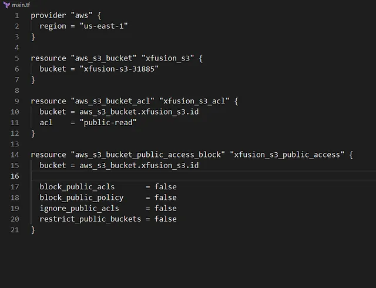

membuat S3 bucket publik bernama xfusion-s3–31885 di region us-east-1 menggunakan Terraform. Penyimpanan objek di AWS untuk menyimpan data seperti file, gambar, atau backup.

Tugas:

Buat S3 bucket publik xfusion-s3–31885 di us-east-1 dengan:

Akses publik melalui pengaturan ACL.
Buat File main.tf

Di direktori /home/bob/terraform, buat file main.tf

Penjelasan:

provider “aws”: Mengatur region AWS ke us-east-1.

aws_s3_bucket: Membuat S3 bucket xfusion-s3–31885.

aws_s3_bucket_acl: Mengatur ACL ke public-read untuk akses publik.

aws_s3_bucket_public_access_block: Menonaktifkan semua pengaturan blok akses publik untuk memungkinkan ACL berfungsi.

