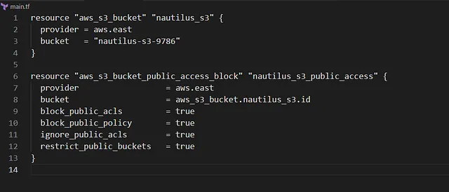

membuat S3 bucket privat bernama nautilus-s3–9786 di region us-east-1 menggunakan Terraform. Nama bucket: nautilus-s3–9786.

Akses: Privat, dengan semua akses publik diblokir melalui pengaturan Block Public Access.

Region: us-east-1.

Konfigurasi ditulis di file main.tf di direktori /home/bob/terraform

🛠 Langkah Praktik

Buat File main.tf
Di direktori /home/bob/terraform, buat file main.tf

Penjelasan:

provider “aws”: Mengatur region AWS ke us-east-1.

aws_s3_bucket: Membuat S3 bucket nautilus-s3–9786.

aws_s3_bucket_public_access_block: Mengaktifkan semua pengaturan Block Public Access untuk memastikan bucket privat:

block_public_acls: Mencegah ACL publik.

block_public_policy: Mencegah bucket policy publik.

ignore_public_acls: Mengabaikan ACL publik yang ada.

restrict_public_buckets: Membatasi akses publik meskipun policy diterapkan.

