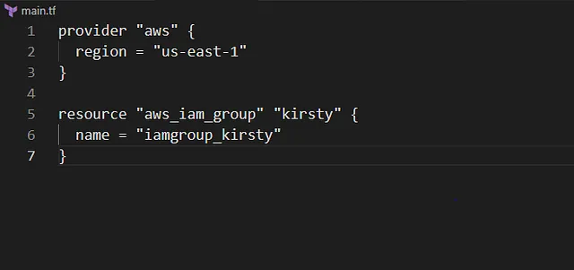

membuat IAM group bernama iamgroup_kirsty menggunakan Terraform

Grup iamgroup_kirsty memungkinkan pengelolaan izin untuk beberapa pengguna secara bersamaan, seperti anggota tim Kirsty.

🛠 Langkah Praktik

Buat File main.tf
Di direktori /home/bob/terraform, buat file main.tf

Penjelasan:

provider “aws”: Mengatur region AWS ke us-east-1.
aws_iam_group: Membuat IAM group dengan nama iamgroup_kirsty.