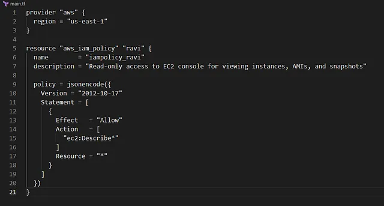

membuat IAM policy bernama iampolicy_ravi menggunakan Terraform

Nama policy: iampolicy_ravi.
Region: us-east-1 (meskipun IAM adalah layanan global, Terraform dikonfigurasi untuk konsistensi).
Izin: Read-only access ke EC2 console, memungkinkan pengguna untuk melihat semua instance, AMIs, dan snapshot.
Konfigurasi ditulis di file main.tf di direktori /home/bob/terraform.
🛠 Langkah Praktik

. Buat File main.tf
Di direktori /home/bob/terraform, buat file main.tf

Penjelasan:

provider “aws”: Mengatur region AWS ke us-east-1 untuk konsistensi (meskipun IAM adalah layanan global).
aws_iam_policy: Membuat IAM policy dengan:
name: iampolicy_ravi.
description: Menjelaskan tujuan policy untuk kejelasan.
policy: Dokumen JSON yang mengizinkan aksi ec2:Describe* untuk semua sumber daya (*), memberikan akses read-only ke EC2 console (instance, AMIs, snapshot).