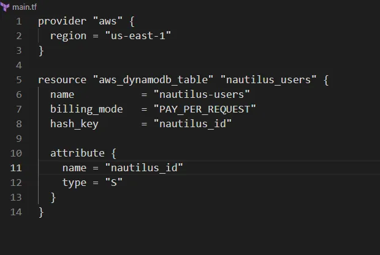

Membuat DynamoDB table bernama nautilus-users menggunakan Terraform

Nama table: nautilus-users.
Primary key: nautilus_id (tipe String).
Billing mode: PAY_PER_REQUEST.
Konfigurasi ditulis di file main.tf di direktori /home/bob/terraform
Buat File main.tf
Di direktori /home/bob/terraform, buat file main.tf

Penjelasan:

provider “aws”: Mengatur region AWS ke us-east-1.
aws_dynamodb_table: Membuat DynamoDB table dengan:
name: nautilus-users.
billing_mode: PAY_PER_REQUEST untuk penagihan berdasarkan permintaan.
hash_key: nautilus_id sebagai primary key (partition key).
attribute: Mendefinisikan nautilus_id sebagai tipe String (S).