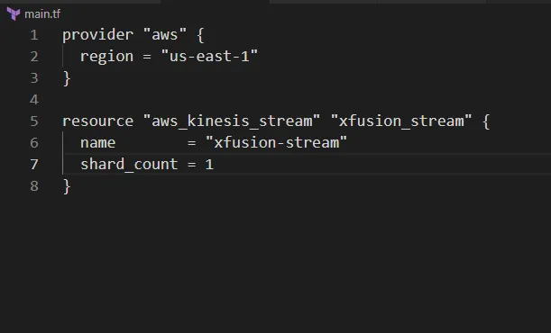

Membuat AWS Kinesis Data Stream bernama xfusion-stream menggunakan Terraform

🛠 Langkah Praktik

. Buat File main.tf
Di direktori /home/bob/terraform, buat file main.tf

Penjelasan:

provider “aws”: Mengatur region AWS ke us-east-1.

aws_kinesis_stream: Membuat Kinesis Data Stream dengan:
name: xfusion-stream.

shard_count: 1 (default untuk kebutuhan dasar, mendukung 1 MB/detik input dan 2 MB/detik output).
