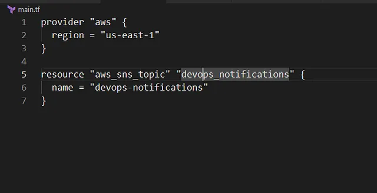

Membuat AWS SNS Topic bernama devops-notifications menggunakan Terraform

Layanan AWS Simple Notification Service (SNS) untuk mengirim pesan atau notifikasi ke subscriber seperti email, SMS, atau Lambda.

Buat File main.tf
Di direktori /home/bob/terraform, buat file main.tf

Penjelasan:

provider “aws”: Mengatur region AWS ke us-east-1 untuk konsistensi (meskipun SNS topic bersifat global dalam beberapa aspek, konfigurasi dilakukan per region).
aws_sns_topic: Membuat SNS topic dengan:
name: devops-notifications