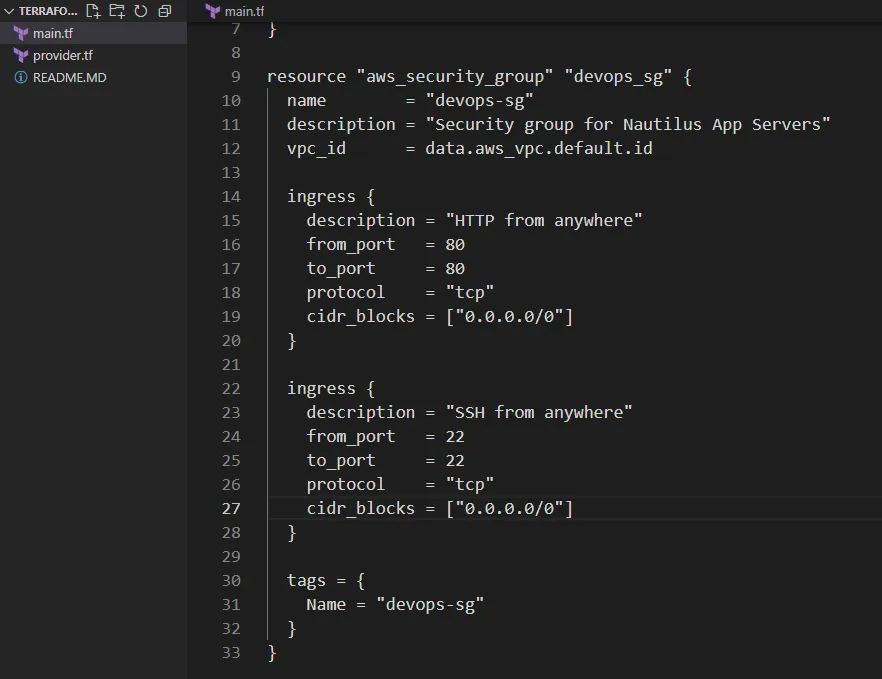
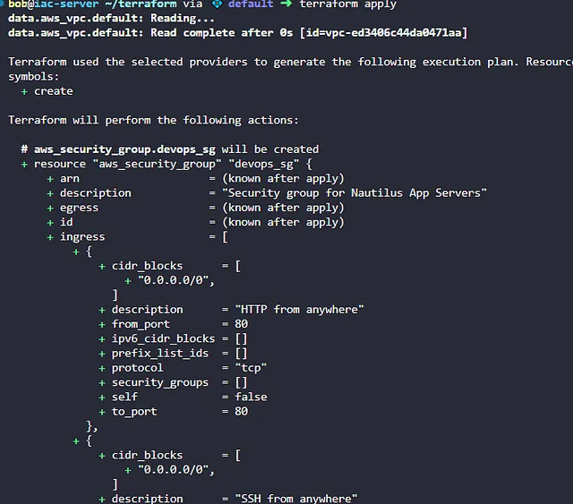

Membuat security group devops-sg di bawah default VPC di region us-east-1 menggunakan Terraform, dengan deskripsi “Security group for Nautilus App Servers” dan aturan inbound untuk HTTP (port 80) dan SSH (port 22) dari sumber 0.0.0.0/0

Security group mengatur lalu lintas jaringan ke instance EC2, memastikan hanya port HTTP (80) dan SSH (22) yang diizinkan dari sumber publik.

🛠 Langkah 

Buat File main.tf

Di direktori /home/bob/terraform, buat file main.tf

Penjelasan:

provider “aws”: Mengatur region AWS ke us-east-1.

data “aws_vpc” “default”: Mengambil ID default VPC.

aws_security_group: Membuat security group devops-sg dengan deskripsi dan aturan inbound untuk HTTP (port 80) dan SSH (port 22) dari 0.0.0.0/0.

tags: Menambahkan tag untuk identifikasi.

lalu jalankan terraform init, plan, dan apply di terminal

