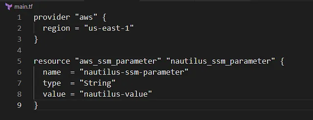

membuat AWS SSM Parameter bernama nautilus-ssm-parameter menggunakan Terraform

Buat File main.tf
Di direktori /home/bob/terraform, buat file main.tf

Penjelasan:

provider “aws”: Mengatur region AWS ke us-east-1.

aws_ssm_parameter: Membuat SSM parameter dengan:
name: nautilus-ssm-parameter.

type: String untuk teks biasa.

value: nautilus-value.
