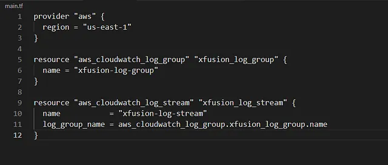

membuat AWS CloudWatch Log Group bernama xfusion-log-group dan Log Stream bernama xfusion-log-stream. log stream di AWS CloudWatch untuk menyimpan dan mengelola log aplikasi atau sistem.

🛠 Langkah Praktis

Buat File main.tf
Di direktori /home/bob/terraform, buat file main.tf

Penjelasan:

provider “aws”: Mengatur region AWS ke us-east-1.

aws_cloudwatch_log_group: Membuat log group dengan:
name: xfusion-log-group.

aws_cloudwatch_log_stream: Membuat log stream dengan:
name: xfusion-log-stream.

log_group_name: Referensi ke log group xfusion-log-group menggunakan aws_cloudwatch_log_group.xfusion_log_group.name.