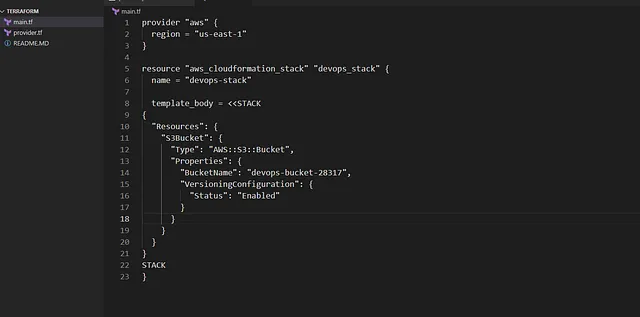

membuat AWS CloudFormation Stack bernama devops-stack menggunakan Terraform

Nama stack: devops-stack.
Resource: S3 bucket bernama devops-bucket-28317 dengan versioning diaktifkan.

Konfigurasi ditulis di file main.tf di direktori /home/bob/terraform.

CloudFormation stack ini mendukung strategi Nautilus DevOps team untuk mengotomatisasi provisioning infrastruktur S3 bucket.

Menggunakan CloudFormation melalui Terraform memungkinkan deployment S3 bucket yang konsisten

🛠 Langkah Praktik

Buat File main.tf
Di direktori /home/bob/terraform, buat file main.tf

Penjelasan:

provider “aws”: Mengatur region AWS ke us-east-1.

aws_cloudformation_stack: Membuat CloudFormation stack dengan:
name: devops-stack.

template_body: Template YAML yang mendefinisikan S3 bucket:
Resource AWS::S3::Bucket dengan nama devops-bucket-28317.

VersioningConfiguration dengan Status: Enabled untuk mengaktifkan versioning.