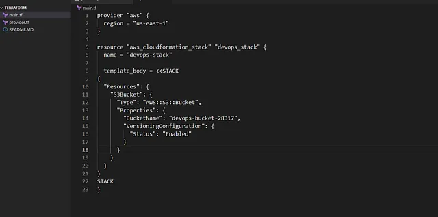

membuat Amazon OpenSearch Service Domain bernama datacenter-es menggunakan Terraform. Layanan AWS untuk menyimpan, mencari, dan menganalisis data seperti log atau metrik menggunakan OpenSearch

🛠 Langkah Praktik

Buat File main.tf
Di direktori /home/bob/terraform, buat file main.tf

Penjelasan:

provider “aws”: Mengatur region AWS ke us-east-1.
aws_opensearch_domain: Membuat OpenSearch domain dengan:
domain_name: datacenter-es.
engine_version: OpenSearch_2.11 (versi stabil terbaru per 2025).
cluster_config: Menggunakan instance t3.small.search (ukuran kecil untuk tugas dasar).
ebs_options: Mengaktifkan EBS dengan ukuran volume 10 GB (minimum).
access_policies: IAM policy sederhana yang mengizinkan akses publik (es:*) untuk mempermudah tugas; di dunia nyata, batasi akses ke principal tertentu.
data “aws_caller_identity”: Mengambil ID akun AWS untuk digunakan dalam ARN policy.
