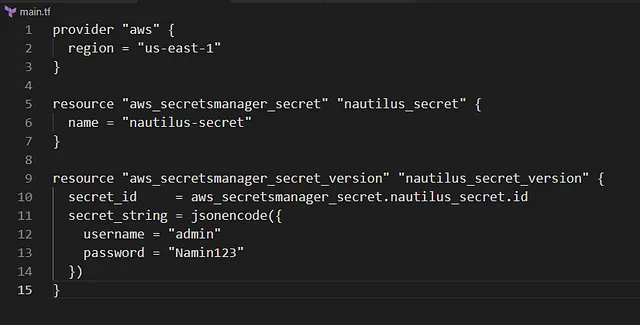

membuat AWS Secrets Manager Secret bernama nautilus-secret menggunakan Terraform.

Nama secret: nautilus-secret.
Nilai secret: Berisi pasangan key-value username: admin dan password: Namin123.
Konfigurasi ditulis di file main.tf di direktori /home/bob/terraform.
🛠 Langkah Praktik

Buat File main.tf
Di direktori /home/bob/terraform, buat file main.tf

Penjelasan:

provider “aws”: Mengatur region AWS ke us-east-1.
aws_secretsmanager_secret: Membuat secret dengan:
name: nautilus-secret.
aws_secretsmanager_secret_version: Menambahkan versi secret dengan:
secret_id: Referensi ke secret nautilus-secret.
secret_string: JSON dengan pasangan key-value username: admin dan password: Namin123.
