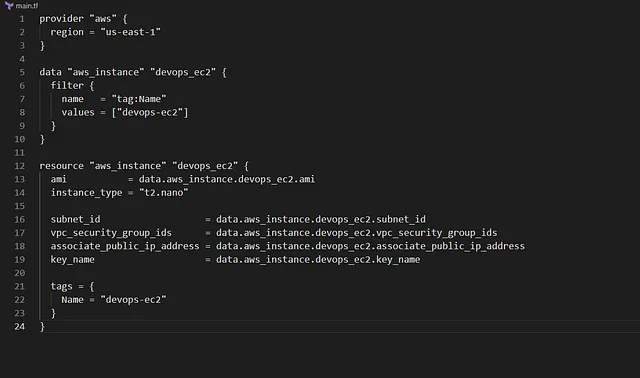

untuk mengubah tipe instance EC2 devops-ec2 dari t2.micro ke t2.nano menggunakan Terraform.

Nama instance: devops-ec2.
Tipe instance awal: t2.micro.
Tipe instance baru: t2.nano.
Pastikan status check selesai (tidak dalam status Initializing) sebelum perubahan.
Pastikan instance dalam status running setelah perubahan.
Konfigurasi diperbarui di file main.tf di direktori /home/bob/terraform
Mengganti t2.micro (1 vCPU, 1 GB RAM) dengan t2.nano (1 vCPU, 0.5 GB RAM) mengurangi biaya untuk instance yang underutilized.

🛠 Langkah Praktik

Perbarui File main.tf

Penjelasan:

provider “aws”: Mengatur region AWS ke us-east-1.
data “aws_instance”: Mengambil konfigurasi existing instance devops-ec2 berdasarkan tag Name.
aws_instance: Memperbarui instance dengan:
instance_type: t2.nano (diubah dari t2.micro).
ami, subnet_id, vpc_security_group_ids, associate_public_ip_address, key_name: Diambil dari instance existing untuk mempertahankan konfigurasi.
tags: Mempertahankan tag Name: devops-ec2.