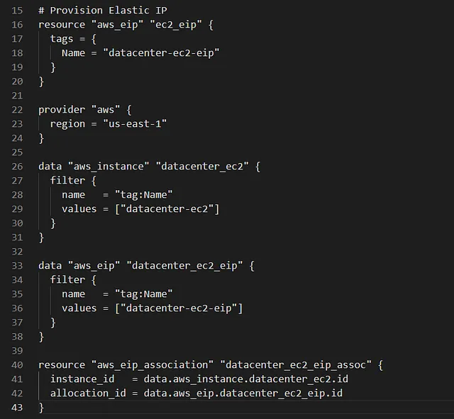

untuk mengaitkan Elastic IP datacenter-ec2-eip dengan instance EC2 datacenter-ec2 di region us-east-1 menggunakan Terraform.

Elastic IP datacenter-ec2-eip menyediakan alamat IP publik statis, memastikan aplikasi di datacenter-ec2 tetap dapat diakses meskipun instance dihentikan atau diganti.

🛠 Langkah Praktik

Perbarui File main.tf
Di direktori /home/bob/terraform, perbarui atau buat file main.tf

Penjelasan:

provider “aws”: Mengatur region AWS ke us-east-1.
data “aws_instance”: Mengambil detail instance datacenter-ec2 berdasarkan tag Name.
data “aws_eip”: Mengambil detail Elastic IP datacenter-ec2-eip berdasarkan tag Name.
aws_eip_association: Mengaitkan Elastic IP dengan instance menggunakan:
instance_id: ID instance datacenter-ec2.
allocation_id: ID alokasi Elastic IP datacenter-ec2-eip.