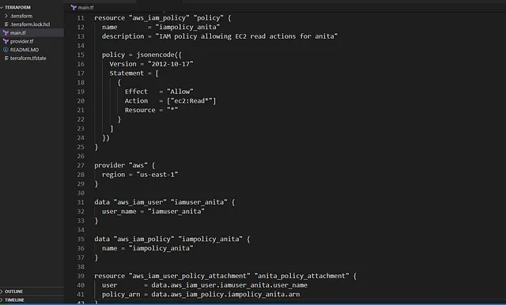

untuk mengaitkan IAM policy iampolicy_anita dengan IAM user iamuser_anita menggunakan Terraform. Nama IAM user: iamuser_anita.

Nama IAM policy: iampolicy_anita.
Konfigurasi diperbarui di file main.tf di direktori /home/bob/terraform
Policy iampolicy_anita memberikan izin spesifik kepada iamuser_anita untuk mengakses sumber daya AWS, seperti EC2 atau Secrets Manager.
🛠️ Langkah Praktik

Perbarui File main.tf
Di direktori /home/bob/terraform, perbarui atau buat file main.tf

Penjelasan:

provider “aws”: Mengatur region AWS ke us-east-1 (meskipun IAM adalah layanan global, region diatur untuk konsistensi).
data “aws_iam_user”: Mengambil detail IAM user iamuser_anita berdasarkan nama.
data “aws_iam_policy”: Mengambil detail IAM policy iampolicy_anita berdasarkan nama.
aws_iam_user_policy_attachment: Mengaitkan policy dengan user menggunakan:
user: Nama user iamuser_anita.
policy_arn: ARN policy iampolicy_anita.
