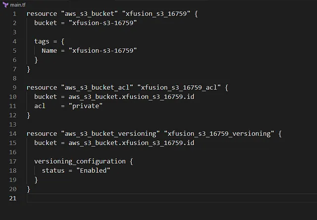

untuk mengaktifkan versioning pada S3 bucket xfusion-s3–16759 menggunakan Terraform. Versioning memungkinkan pemulihan objek yang dihapus atau ditimpa, mencegah kehilangan data akibat kesalahan manusia.

1.. Perbarui File main.tf
Di direktori /home/bob/terraform, perbarui atau buat file main.tf

Penjelasan:

provider “aws”: Mengatur region AWS ke us-east-1.
aws_s3_bucket: Mendefinisikan bucket xfusion-s3–16759 (diperlukan untuk Terraform mengelola versioning).
aws_s3_bucket_versioning: Mengaktifkan versioning dengan:
bucket: ID bucket xfusion-s3–16759.
versioning_configuration.status: Set ke “Enabled” untuk mengaktifkan versioning.