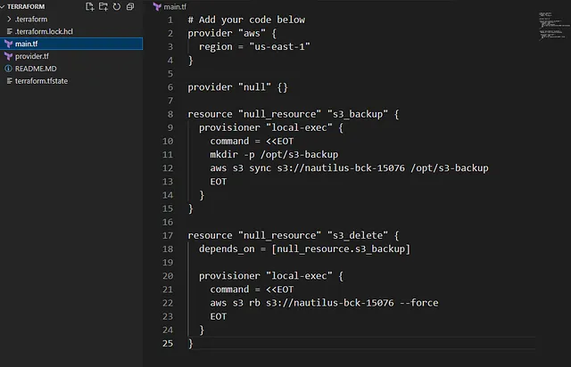

Mencopy seluruh konten dari S3 bucket nautilus-bck-15076 ke direktori /opt/s3-backup/ pada host terraform-client.

Menghapus S3 bucket nautilus-bck-15076 setelah pencopyan selesai.

Pengoperasian dilakukan menggunakan AWS CLI melalui Terraform.

Konfigurasi diperbarui di file main.tf di direktori /home/bob/terraform

🛠️ Langkah Praktik

1. Perbarui File main.tf
Di direktori /home/bob/terraform, perbarui atau buat file main.tf

Penjelasan:

provider “aws”: Mengatur region AWS ke us-east-1.

provider “null”: Mengaktifkan null provider untuk menjalankan perintah lokal.

null_resource.s3_backup: Menjalankan perintah untuk:
Membuat direktori /opt/s3-backup (untuk redundansi).

Mencopy konten bucket dengan aws s3 sync s3://nautilus-bck-15076 /opt/s3-backup.
null_resource.s3_delete: Menjalankan perintah untuk:

Menghapus bucket dengan aws s3 rb s3://nautilus-bck-15076 — force (menghapus semua objek dan bucket).

depends_on: Memastikan pencopyan selesai sebelum penghapusan.

Catatan:

aws s3 sync mencopy semua objek, termasuk struktur direktori.

— force pada aws s3 rb menghapus semua objek (termasuk versi jika versioning aktif) dan bucket.

Jika bucket memiliki versioning, semua versi objek akan dihapus oleh — force.
