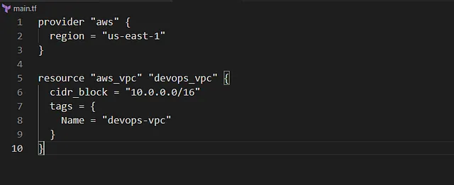
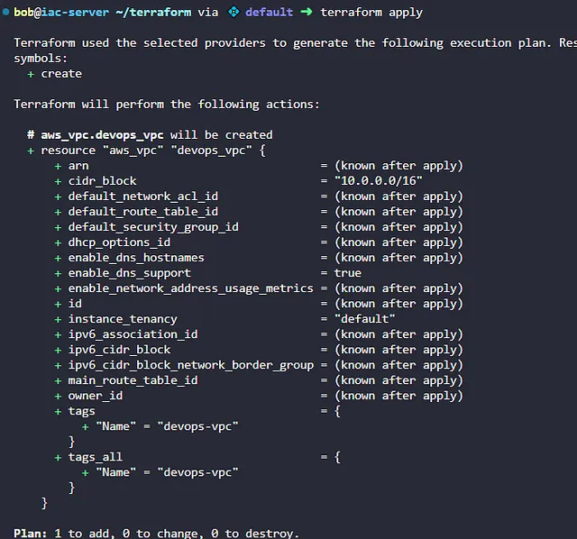

Membuat VPC bernama devops-vpc di region us-east-1 dengan blok CIDR IPv4 menggunakan Terraform, dengan konfigurasi ditulis di file main.tf di direktori /home/bob/terraform. VPC ini menyediakan lingkungan jaringan terisolasi untuk mendukung migrasi Nautilus ke AWS cloud.

🛠 Langkah Praktik

Buat File main.tf

Di direktori /home/bob/terraform, buat file main.tf

Penjelasan:

provider “aws”: Mengatur region AWS ke us-east-1.

aws_vpc: Membuat VPC devops-vpc dengan blok CIDR 10.0.0.0/16.

tags: Menambahkan tag untuk identifikasi.
~~~
2. jalankan terraform init, plan, apply

~~~
