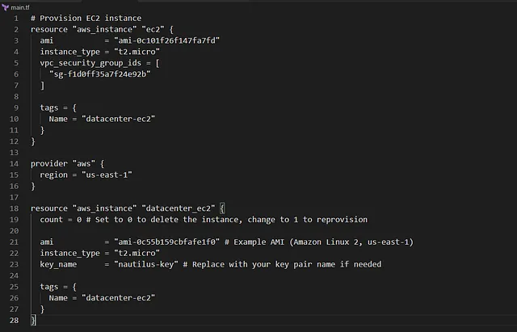

Menghapus instance EC2 bernama datacenter-ec2 di region us-east-1 menggunakan Terraform.

Mempertahankan kode provisioning di file main.tf untuk memungkinkan pembuatan ulang instance di masa depan.

Konfigurasi dilakukan di direktori /home/bob/terraform dengan memperbarui file main.tf.

Sebelum menyelesaikan tugas, pastikan instance berada dalam status terminated.
Tugas ini mendukung upaya Nautilus DevOps team untuk membersihkan sumber daya sementara yang tidak digunakan selama migrasi ke AWS cloud.

1. Perbarui File main.tf
Di direktori /home/bob/terraform, perbarui atau buat file main.tf

Penjelasan:

provider “aws”: Mengatur region AWS ke us-east-1.

aws_instance.datacenter_ec2: Mendefinisikan instance EC2 dengan:

count = 0: Menghapus instance dengan tidak membuat resource baru. Untuk membuat ulang, ubah ke count = 1.

ami: Contoh AMI untuk Amazon Linux 2 di us-east-1 (ganti dengan AMI asli jika diketahui).

instance_type: t2.micro sebagai contoh (ganti sesuai kebutuhan).
key_name: Nama key pair untuk SSH (ganti jika diperlukan).

tags: Menetapkan tag Name: datacenter-ec2 untuk identifikasi.