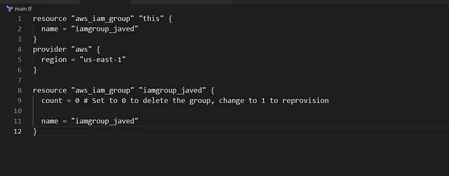

Menghapus IAM group bernama iamgroup_javed di AWS menggunakan Terraform.

Mempertahankan kode provisioning di file main.tf untuk memungkinkan pembuatan ulang group di masa depan.

Konfigurasi dilakukan di direktori /home/bob/terraform dengan memperbarui file main.tf.

🛠️ Langkah Praktik

Penjelasan:

provider “aws”: Mengatur region AWS ke us-east-1 (untuk konsistensi).

aws_iam_group.iamgroup_javed: 

Mendefinisikan IAM group dengan:

count = 0: Menghapus group dengan tidak membuat resource baru. Untuk membuat ulang, ubah ke count = 1.

name: Nama group iamgroup_javed.