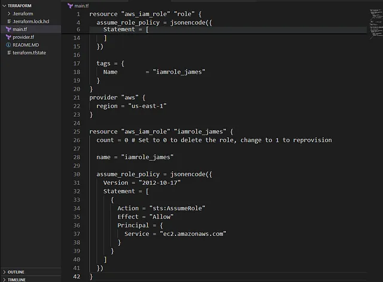

Menghapus IAM role bernama iamrole_james di AWS menggunakan Terraform.
Mempertahankan kode provisioning di file main.tf untuk memungkinkan pembuatan ulang role di masa depan.
Konfigurasi dilakukan di direktori /home/bob/terraform dengan memperbarui file main.tf.
Menghapus role sementara seperti iamrole_james mengurangi kompleksitas manajemen IAM dan menjaga lingkungan AWS tetap rapi.

🛠 Langkah Praktik

1.. Perbarui File main.tf
Di direktori /home/bob/terraform, perbarui atau buat file main.tf

Penjelasan:

provider “aws”: Mengatur region AWS ke us-east-1 (untuk konsistensi).
aws_iam_role.iamrole_james: Mendefinisikan IAM role dengan:
count = 0: Menghapus role dengan tidak membuat resource baru. Untuk membuat ulang, ubah ke count = 1.
name: Nama role iamrole_james.
assume_role_policy: Trust policy yang memungkinkan EC2 untuk mengasumsikan role (contoh standar; ganti jika trust policy asli berbeda).