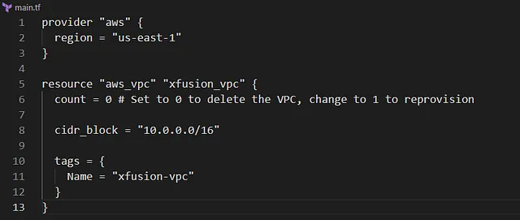

Menghapus VPC bernama xfusion-vpc di region us-east-1 menggunakan Terraform.

Mempertahankan kode provisioning di file main.tf untuk memungkinkan pembuatan ulang VPC di masa depan.

Konfigurasi dilakukan di direktori /home/bob/terraform dengan memperbarui file main.tf.

Pastikan VPC dihapus sebelum menyelesaikan tugas.

Menghapus VPC yang tidak digunakan seperti xfusion-vpc mengurangi biaya terkait sumber daya jaringan yang mungkin masih aktif (misalnya, NAT Gateway

🛠️ Langkah Praktik

Perbarui File main.tf
Di direktori /home/bob/terraform, perbarui atau buat file main.tf

Penjelasan:

provider “aws”: Mengatur region AWS ke us-east-1.

aws_vpc.xfusion_vpc: Mendefinisikan VPC dengan:

count = 0: Menghapus VPC dengan tidak membuat resource baru. Untuk membuat ulang, ubah ke count = 1.

cidr_block: Contoh CIDR block 10.0.0.0/16 (ganti dengan CIDR asli jika diketahui).
tags: Menetapkan tag Name: xfusion-vpc untuk identifikasi.