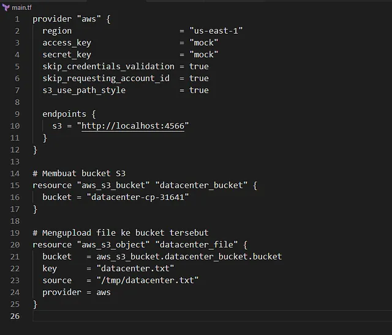

Menyalin file /tmp/datacenter.txt ke S3 bucket datacenter-cp-31641 yang sudah ada menggunakan Terraform.
Memperbarui file main.tf di direktori /home/bob/terraform untuk mencapai tugas ini tanpa membuat file .tf terpisah.
Mendukung transisi data dari on-premise ke cloud, memastikan data tersedia di S3 untuk aplikasi

🛠 Langkah Praktik

Penjelasan:

provider “aws”: Mengatur region AWS ke us-east-1 untuk konsistensi.
aws_s3_object.datacenter_file: Mendefinisikan unggahan file dengan:
bucket: Nama bucket datacenter-cp-31641.
key: Nama file di S3 (datacenter.txt di root bucket).
source: Path file lokal /tmp/datacenter.txt.
Catatan:

Resource aws_s3_object digunakan karena bucket sudah ada (bukan aws_s3_bucket).
Tidak ada count = 0 karena tugas adalah mengunggah, bukan menghapus.
Jika file perlu diunggah ke subfolder, ubah key, misalnya: key = “data/datacenter.txt”.
Jika versioning diperlukan, tambahkan versioning ke bucket (jika dikelola oleh Terraform) atau verifikasi secara manual.