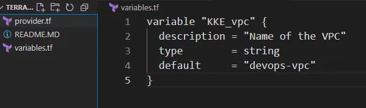
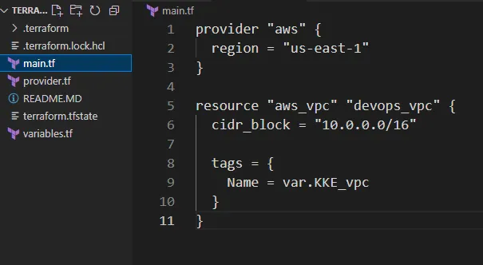

Membuat AWS VPC dengan nama devops-vpc menggunakan Terraform.

Menyimpan nama VPC dalam variabel bernama KKE_vpc di file variables.tf.

Mengatur CIDR block VPC ke 10.0.0.0/16.

Menggunakan struktur Terraform dengan main.tf yang mereferensikan variables.tf

🛠️ Langkah Praktik

Buat File variables.tf
Di direktori /home/bob/terraform, buat file variables.tf

variable “KKE_vpc”: Mendefinisikan variabel untuk nama VPC.

description: Menjelaskan tujuan variabel.
type: Menetapkan tipe data sebagai string.
default: Mengatur nilai default ke devops-vpc.

Buat File main.tf
Di direktori /home/bob/terraform, buat atau perbarui file main.tf

Penjelasan:

provider “aws”: Mengatur region AWS ke us-east-1.

aws_vpc.devops_vpc: Mendefinisikan VPC dengan:

cidr_block: Mengatur rentang IP ke 10.0.0.0/16.

tags: Menetapkan tag Name menggunakan variabel KKE_vpc (nilai: devops-vpc)