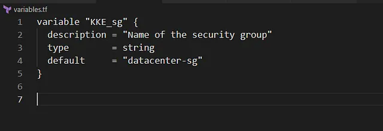
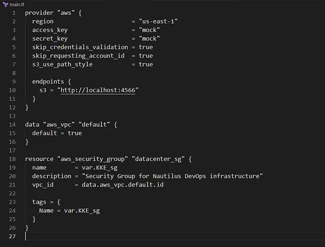

Membuat AWS Security Group dengan nama datacenter-sg menggunakan Terraform.

Menyimpan nama Security Group dalam variabel bernama KKE_sg di file variables.tf.

Menggunakan struktur Terraform dengan main.tf yang mereferensikan variables.tf.

Konfigurasi dilakukan di direktori /home/bob/terraform

🛠️ Langkah Praktik

Buat File variables.tf
Di direktori /home/bob/terraform, buat file variables.tf

Penjelasan:

variable “KKE_sg”: Mendefinisikan variabel untuk nama Security Group.

description: Menjelaskan tujuan variabel.
type: Menetapkan tipe data sebagai string.
default: Mengatur nilai default ke datacenter-sg.

Buat File main.tf

Di direktori /home/bob/terraform, buat atau perbarui file main.tf

Penjelasan:

provider “aws”: Mengatur region AWS ke us-east-1.

data “aws_vpc” “default”: Mengambil ID VPC default di region us-east-1.

aws_security_group.datacenter_sg: Mendefinisikan Security Group dengan:
name: Menggunakan variabel KKE_sg (nilai: datacenter-sg).

description: Menjelaskan tujuan Security Group.

vpc_id: Mengaitkan Security Group dengan VPC default.

tags: Menetapkan tag Name menggunakan variabel KKE_sg