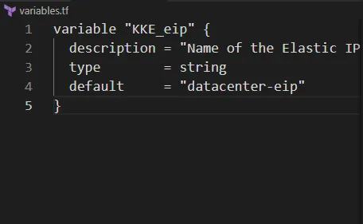
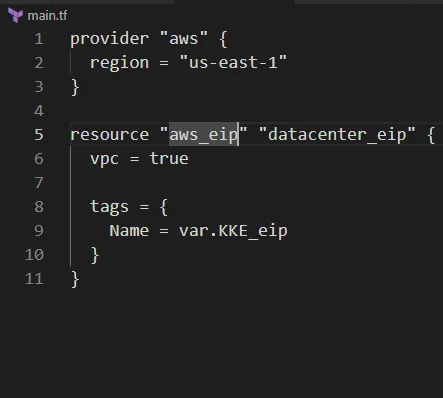

Membuat AWS Elastic IP dengan nama datacenter-eip menggunakan Terraform.
Menyimpan nama Elastic IP dalam variabel bernama KKE_eip di file variables.tf.
Menggunakan struktur Terraform dengan main.tf yang mereferensikan variables.tf.
Konfigurasi dilakukan di direktori /home/bob/terraform

🛠 Langkah Praktik

1. Buat File variables.tf
Di direktori /home/bob/terraform, buat file variables.tf

variable “KKE_eip”: Mendefinisikan variabel untuk nama Elastic IP.
description: Menjelaskan tujuan variabel.
type: Menetapkan tipe data sebagai string.
default: Mengatur nilai default ke datacenter-eip.
2. Buat File main.tf
Di direktori /home/bob/terraform, buat atau perbarui file main.tf

Penjelasan:

provider “aws”: Mengatur region AWS ke us-east-1.
aws_eip.datacenter_eip: Mendefinisikan Elastic IP dengan:
vpc = true: Mengalokasikan Elastic IP untuk penggunaan dalam VPC.
tags: Menetapkan tag Name menggunakan variabel KKE_eip (nilai: datacenter-eip).
