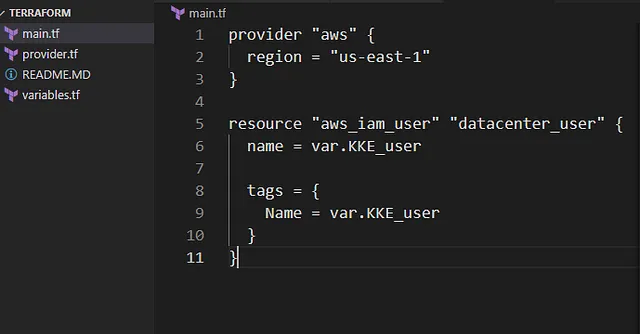

Membuat AWS IAM User dengan nama iamuser_james menggunakan Terraform.
Menyimpan nama IAM User dalam variabel bernama KKE_user di file variables.tf.
Menggunakan struktur Terraform dengan main.tf yang mereferensikan variables.tf.
Konfigurasi dilakukan di direktori /home/bob/terraform.
1. Buat File variables.tf
Di direktori /home/bob/terraform, buat file variables.tf

Penjelasan:

variable “KKE_user”: Mendefinisikan variabel untuk nama IAM User.
description: Menjelaskan tujuan variabel.
type: Menetapkan tipe data sebagai string.
default: Mengatur nilai default ke iamuser_james.
2. Buat File main.tf
Di direktori /home/bob/terraform, buat atau perbarui file main.tf

Penjelasan:

provider “aws”: Mengatur region AWS ke us-east-1 untuk konsistensi.
aws_iam_user.datacenter_user: Mendefinisikan IAM User dengan:
name: Menggunakan variabel KKE_user (nilai: iamuser_james).
tags: Menetapkan tag Name menggunakan variabel KKE_user.