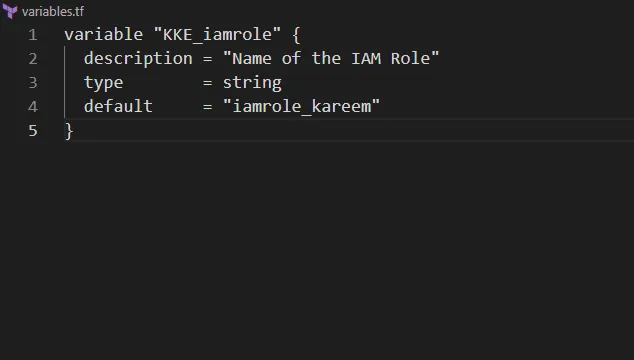
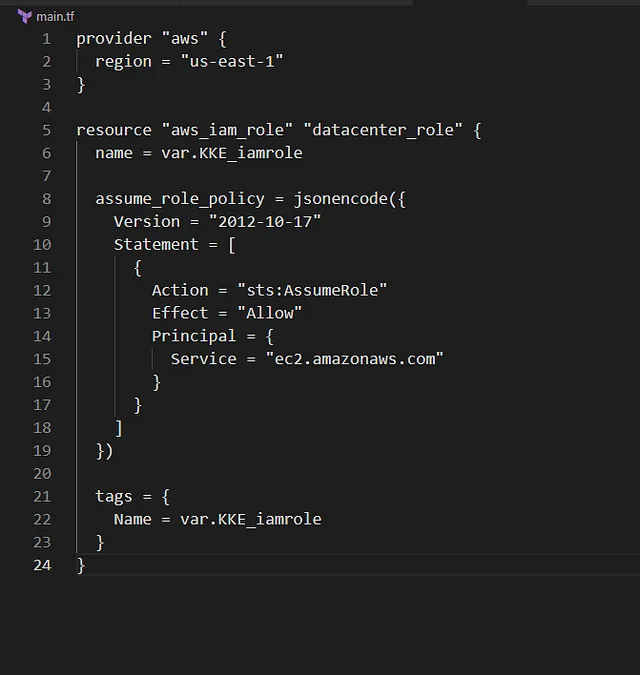

Membuat AWS IAM Role dengan nama iamrole_kareem menggunakan Terraform.

Menyimpan nama IAM Role dalam variabel bernama KKE_iamrole di file variables.tf.

Menggunakan struktur Terraform dengan main.tf yang mereferensikan variables.tf.

Konfigurasi dilakukan di direktori /home/bob/terraform.

🛠 Langkah Praktik

2. Buat File variables.tf
Di direktori /home/bob/terraform, buat file variables.tf

Penjelasan:

variable “KKE_iamrole”: Mendefinisikan variabel untuk nama IAM Role.

description: Menjelaskan tujuan variabel.
type: Menetapkan tipe data sebagai string.
default: Mengatur nilai default ke iamrole_jim

3. Buat File main.tf
Di direktori /home/bob/terraform, buat atau perbarui file main.tf

provider “aws”: Mengatur region AWS ke us-east-1 untuk konsistensi.

aws_iam_role.datacenter_role: Mendefinisikan IAM Role dengan:
name: Menggunakan variabel KKE_iamrole (nilai: iamrole_kareem).

assume_role_policy: Dokumen JSON yang mengizinkan EC2 mengasumsikan role.

tags: Menetapkan tag Name menggunakan variabel KKE_iamrole.

