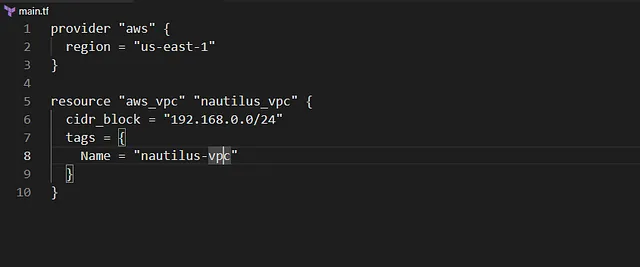
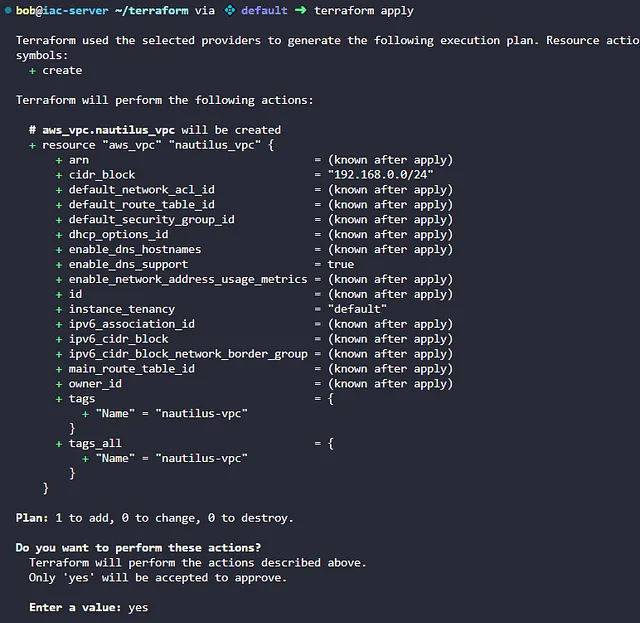

membuat VPC bernama nautilus-vpc di region us-east-1 dengan blok CIDR IPv4 192.168.0.0/24 menggunakan Terraform, dengan konfigurasi ditulis di file main.tf di direktori /home/bob/terraform

🛠 Langkah Praktik

Buat File main.tf

Di direktori /home/bob/terraform, buat file main.tf

Penjelasan:

provider “aws”: Mengatur region AWS ke us-east-1.

aws_vpc: Membuat VPC nautilus-vpc dengan blok CIDR 192.168.0.0/24.

tags: Menambahkan tag untuk identifikasi.

2. lalu lakukan terraform init, plan, apply

