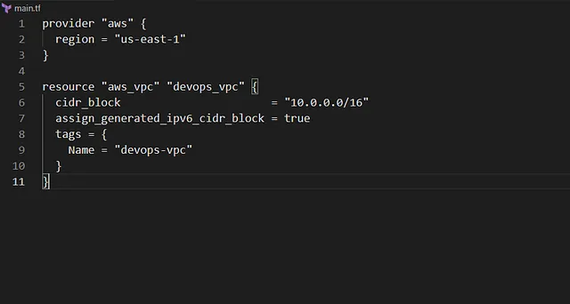

Membuat VPC bernama devops-vpc di region us-east-1 dengan blok CIDR IPv6 yang disediakan oleh Amazon menggunakan Terraform, dengan konfigurasi ditulis di file main.tf di direktori /home/bob/terraform.

Buat File main.tf

Di direktori /home/bob/terraform, buat file main.tf

Penjelasan:

provider “aws”: Mengatur region AWS ke us-east-1.

aws_vpc: Membuat VPC devops-vpc dengan blok CIDR IPv4 10.0.0.0/16 dan mengaktifkan blok CIDR IPv6 yang disediakan Amazon melalui assign_generated_ipv6_cidr_block = true.

tags: Menambahkan tag untuk identifikasi.

