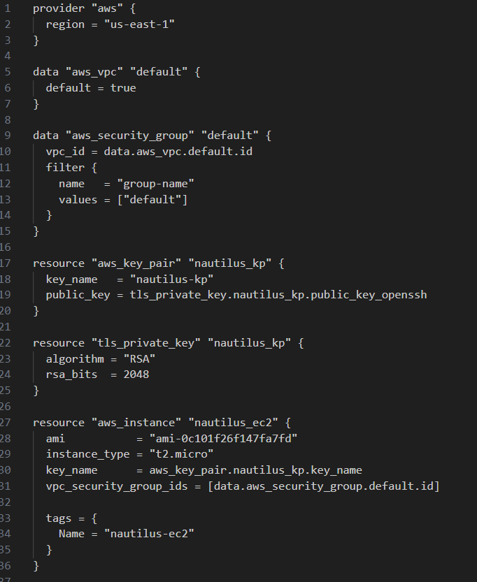

Membuat EC2 instance bernama nautilus-ec2 di region us-east-1 menggunakan Terraform, dengan spesifikasi berikut:

Menggunakan AMI Amazon Linux ami-0c101f26f147fa7fd.

Tipe instance t2.micro.

Membuat RSA key pair baru bernama nautilus-kp.

Menggunakan security group default yang tersedia.

Konfigurasi ditulis di file main.tf di direktori /home/bob/terraform. 

🛠 Langkah Praktik

Buat File main.tf

Di direktori /home/bob/terraform, buat file main.tf

Penjelasan:

provider “aws”: Mengatur region AWS ke us-east-1.

data “aws_vpc” “default”: Mengambil default VPC untuk instance.

data “aws_security_group” “default”: Mengambil security group default di default VPC.

tls_private_key: Membuat kunci privat RSA untuk key pair.

aws_key_pair: Membuat key pair nautilus-kp dengan kunci publik.

aws_instance: Membuat EC2 instance nautilus-ec2 dengan AMI, tipe t2.micro, key pair, dan security group default.

local_file: Menyimpan kunci privat ke file nautilus-kp.pem untuk akses SSH.

tags: Menambahkan tag Name = “nautilus-ec2” untuk identifikasi.
~~~
Jalankan Terraform init, plan, apply
~~~