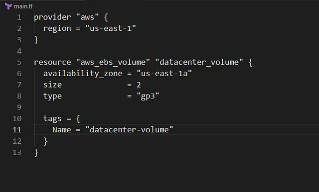

Membuat EBS volume bernama datacenter-volume di region us-east-1 menggunakan Terraform, dengan spesifikasi berikut:

Tipe volume: gp3.
Ukuran volume: 2 GiB.
Region: us-east-1.
Konfigurasi ditulis di file main.tf di direktori /home/bob/terraform. EBS volume ini mendukung migrasi Nautilus ke AWS cloud dengan menyediakan penyimpanan tambahan untuk instance EC2 atau data aplikasi.
EBS volume datacenter-volume menyediakan penyimpanan persisten untuk data aplikasi atau instance EC2.

🛠 Langkah Praktik

Buat File main.tf
Di direktori /home/bob/terraform, buat file main.tf

provider “aws”: Mengatur region AWS ke us-east-1.

aws_ebs_volume: Membuat EBS volume datacenter-volume dengan:

availability_zone: us-east-1a (default umum untuk region).

size: 2 GiB.
type: gp3.

tags: Menambahkan tag Name = “datacenter-volume” untuk identifikasi.

2. Jalankan terraform init, plan, dan apply