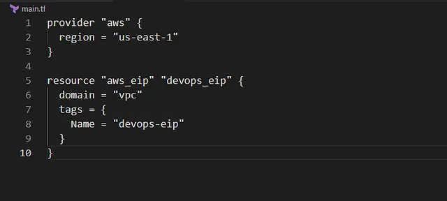

Mengalokasikan Elastic IP address bernama devops-eip di region us-east-1 menggunakan Terraform, dengan konfigurasi ditulis di file main.tf di direktori /home/bob/terraform. Elastic IP devops-eip memberikan alamat IP statis yang tidak berubah. Elastic IP digunakan dalam VPC untuk instance EC2 yang memerlukan akses publik.

Langkah Praktik:

Buat File main.tf

Di direktori /home/bob/terraform, buat file main.tf

Penjelasan:

provider “aws”: Mengatur region AWS ke us-east-1.

aws_eip: Mengalokasikan Elastic IP dengan domain = “vpc” untuk digunakan dalam VPC.

tags: Menambahkan tag Name = “devops-eip” untuk identifikasi.

2. Jalankan terraform init, plan, apply
