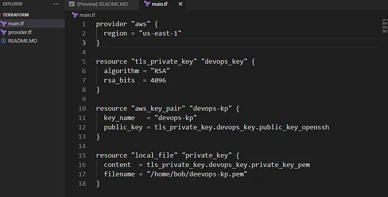

Membuat key pair AWS bernama devops-kp menggunakan Terraform, dengan tipe kunci RSA, dan menyimpan kunci privat di /home/bob. Key pair ini memungkinkan akses aman ke instance EC2 selama migrasi Nautilus ke AWS cloud.

membuat key pair dengan Terraform adalah langkah kunci untuk mengamankan akses ke instance EC2.

🛠️ Langkah Praktik

Buat File main.tf
Di direktori /home/bob/terraform, buat file main.tf

Penjelasan:

~~~
provider “aws”: Mengatur region AWS ke us-east-1.
~~~
~~~
tls_private_key: Membuat kunci RSA dengan 4096 bit.
~~~
~~~
aws_key_pair: Membuat key pair devops-kp di AWS.
~~~
~~~
local_file: Menyimpan kunci privat di /home/bob/devops-kp.pem
~~~